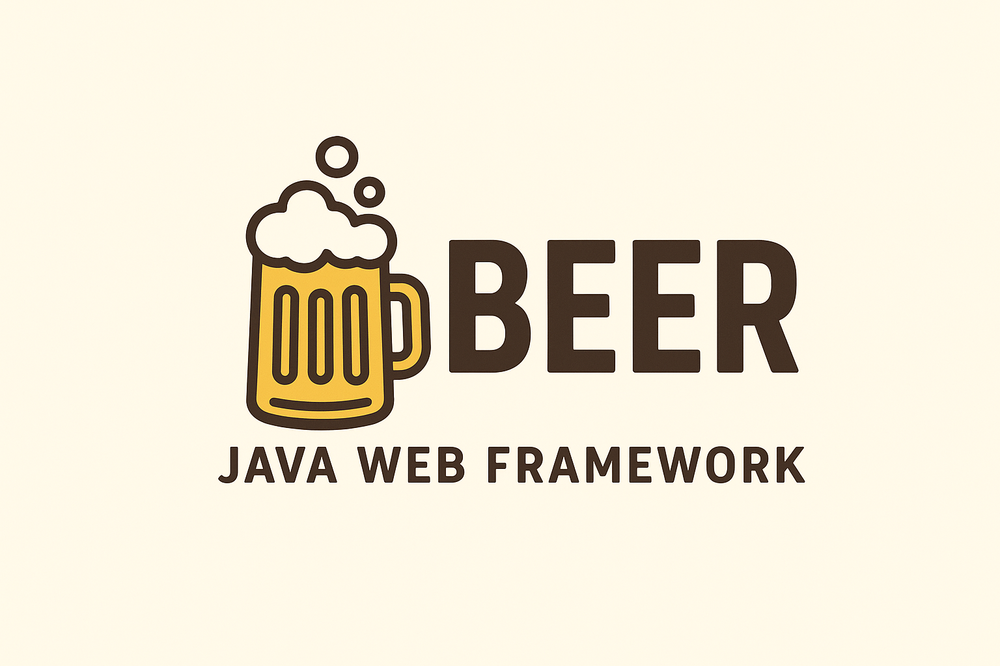

<p align="center">

</p>

**Beer** is a lightweight Java library that makes it simple to build RESTful web applications using Jetty and Servlets — without the boilerplate. Just pour your routes, filters, static files, and you’re ready to serve!

---

## ✨ Features

- ✅ **Simple route handling** — define `GET`, `POST`, `PUT`, `DELETE` handlers with ease.
- ✅ **Wildcard routes** — match dynamic paths simply.
- ✅ **Filters & CORS** — add pre-processing, logging, or CORS with one line.
- ✅ **Serve static files** — easily host static content alongside your API.
- ✅ **HTTPS support** — configure SSL out of the box.
- ✅ **Centralized exception handling** — return clear JSON error responses.
- ✅ **Runs on Jetty** — robust and production-ready.

---

## 🚀 Quick Start

```java
import gr.kgdev.beer.core.Beer;
import gr.kgdev.beer.utils.BeerUtils;


public class App {
    public static void main(String[] args) throws Exception {
        var beer = new Beer();

        var config = 
            new BeerConfig()
                .setIp("0.0.0.0")
                .setPort(8080)
                .setJettyMinThreads(4)
                .setJettyMaxThreads(32)
                .setJettyIdleTimeout(60000);
                // .setKeystorePath("path/to/keystore"); // For HTTPS
                // .setKeystorePass("yourPassword");

        beer.init(config);

        beer.staticFiles("/", "/public"); // serve static files from classpath /public

        // common filters provided by beer
        beer.corsAllFilter();
        beer.loggingFilter();
        beer.exceptionFilter();

        beer.get("/hello", (req, res) -> Map.of("message", "Hello Beer!"));
        beer.post("/echo", (req, res) -> {
            var body = BeerUtils.parseReqBody(req);
            return Map.of("you_sent", body);
        });

        beer.start();
    }
}
```

## 🏗️ Core Concept

The core class is Beer.

This is where the main capabilities live:

- init(BeerConfig) — configure your server.
- get(), post(), put(), delete() — register route handlers.
- filter() — attach custom servlet filters.
- exceptionFilter() — handle uncaught exceptions globally.
- corsAllFilter() — enable permissive CORS for all routes.
- loggingFilter() — log all incoming requests.
- staticFiles() — serve static files from your classpath.
- start() — start the Jetty server.

## 💡 Inspiration
Beer is inspired by the simplicity of Spark and Express — but built directly on top of Jetty and Servlets to give you control, clarity, and lightweight performance with minimal setup.
